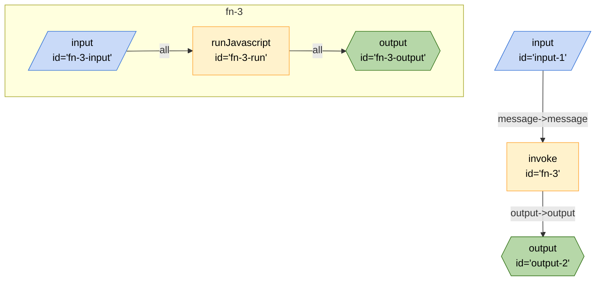

## Mermaid


## JSON
```json
{
	"title": "Xenova Code Node Board",
	"description": "Board which performs sentiment analysis using xenova LLM",
	"url": ".",
	"edges": [
		{
			"from": "fn-3",
			"to": "output-2",
			"out": "output",
			"in": "output"
		},
		{
			"from": "input-1",
			"to": "fn-3",
			"out": "message",
			"in": "message"
		}
	],
	"nodes": [
		{
			"id": "output-2",
			"type": "output",
			"configuration": {
				"schema": {
					"type": "object",
					"properties": {
						"output": {
							"type": "string",
							"title": "output"
						}
					},
					"required": [
						"output"
					]
				}
			}
		},
		{
			"id": "fn-3",
			"type": "invoke",
			"configuration": {
				"path": "#fn-3"
			}
		},
		{
			"id": "input-1",
			"type": "input",
			"configuration": {
				"schema": {
					"type": "object",
					"properties": {
						"message": {
							"type": "string",
							"title": "message"
						}
					},
					"required": [
						"message"
					]
				}
			}
		}
	],
	"graphs": {
		"fn-3": {
			"edges": [
				{
					"from": "fn-3-input",
					"to": "fn-3-run",
					"out": "*"
				},
				{
					"from": "fn-3-run",
					"to": "fn-3-output",
					"out": "*"
				}
			],
			"nodes": [
				{
					"id": "fn-3-input",
					"type": "input",
					"configuration": {}
				},
				{
					"id": "fn-3-run",
					"type": "runJavascript",
					"configuration": {
						"code": "async function fn_3({message}) {const output=await import(\"@xenova/transformers\").then(n=>{const e=\"default\",A=Object.keys(n);return A.length===1&&A[0]===e&&n[e]&&typeof n[e]==\"object\"&&\"__esModule\"in n[e]?n[e]:n}).then(async xenova=>{const pipe=await xenova.pipeline(\"sentiment-analysis\",\"Xenova/bert-base-multilingual-uncased-sentiment\");return await pipe(message)});return{output}}",
						"name": "fn_3",
						"raw": true
					}
				},
				{
					"id": "fn-3-output",
					"type": "output",
					"configuration": {}
				}
			]
		}
	}
}
```