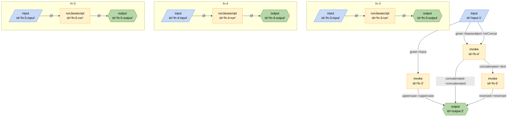

## Mermaid


## JSON
```json
{
	"edges": [
		{
			"from": "fn-3",
			"to": "output-2",
			"out": "uppercase",
			"in": "uppercase"
		},
		{
			"from": "fn-4",
			"to": "fn-5",
			"out": "concatenated",
			"in": "text"
		},
		{
			"from": "fn-4",
			"to": "output-2",
			"out": "concatenated",
			"in": "concatenated"
		},
		{
			"from": "fn-5",
			"to": "output-2",
			"out": "reversed",
			"in": "reversed"
		},
		{
			"from": "input-1",
			"to": "fn-3",
			"out": "greet",
			"in": "input"
		},
		{
			"from": "input-1",
			"to": "fn-4",
			"out": "greet",
			"in": "base"
		},
		{
			"from": "input-1",
			"to": "fn-4",
			"out": "subject",
			"in": "toConcat"
		}
	],
	"nodes": [
		{
			"id": "output-2",
			"type": "output",
			"configuration": {
				"schema": {
					"type": "object",
					"properties": {
						"concatenated": {
							"type": "string",
							"title": "concatenated"
						},
						"reversed": {
							"type": "string",
							"title": "reversed"
						},
						"uppercase": {
							"type": "string",
							"title": "uppercase"
						}
					},
					"required": [
						"concatenated",
						"reversed",
						"uppercase"
					]
				}
			}
		},
		{
			"id": "fn-3",
			"type": "invoke",
			"configuration": {
				"path": "#fn-3"
			}
		},
		{
			"id": "fn-4",
			"type": "invoke",
			"configuration": {
				"path": "#fn-4"
			}
		},
		{
			"id": "fn-5",
			"type": "invoke",
			"configuration": {
				"path": "#fn-5"
			}
		},
		{
			"id": "input-1",
			"type": "input",
			"configuration": {
				"schema": {
					"type": "object",
					"properties": {
						"greet": {
							"type": "string",
							"title": "greet"
						},
						"subject": {
							"type": "string",
							"title": "subject"
						}
					},
					"required": [
						"greet",
						"subject"
					]
				}
			}
		}
	],
	"graphs": {
		"fn-3": {
			"edges": [
				{
					"from": "fn-3-input",
					"to": "fn-3-run",
					"out": "*"
				},
				{
					"from": "fn-3-run",
					"to": "fn-3-output",
					"out": "*"
				}
			],
			"nodes": [
				{
					"id": "fn-3-input",
					"type": "input",
					"configuration": {}
				},
				{
					"id": "fn-3-run",
					"type": "runJavascript",
					"configuration": {
						"code": "function fn_3({input}) {const uppercase=input.toUpperCase();return{uppercase}}",
						"name": "fn_3",
						"raw": true
					}
				},
				{
					"id": "fn-3-output",
					"type": "output",
					"configuration": {}
				}
			]
		},
		"fn-4": {
			"edges": [
				{
					"from": "fn-4-input",
					"to": "fn-4-run",
					"out": "*"
				},
				{
					"from": "fn-4-run",
					"to": "fn-4-output",
					"out": "*"
				}
			],
			"nodes": [
				{
					"id": "fn-4-input",
					"type": "input",
					"configuration": {}
				},
				{
					"id": "fn-4-run",
					"type": "runJavascript",
					"configuration": {
						"code": "function fn_4({base,toConcat}) {const concatenated=base.concat(toConcat);return{concatenated}}",
						"name": "fn_4",
						"raw": true
					}
				},
				{
					"id": "fn-4-output",
					"type": "output",
					"configuration": {}
				}
			]
		},
		"fn-5": {
			"edges": [
				{
					"from": "fn-5-input",
					"to": "fn-5-run",
					"out": "*"
				},
				{
					"from": "fn-5-run",
					"to": "fn-5-output",
					"out": "*"
				}
			],
			"nodes": [
				{
					"id": "fn-5-input",
					"type": "input",
					"configuration": {}
				},
				{
					"id": "fn-5-run",
					"type": "runJavascript",
					"configuration": {
						"code": "function fn_5({text}) {const reversed2=text.split(\"\").reverse().join(\"\");return{reversed:reversed2}}",
						"name": "fn_5",
						"raw": true
					}
				},
				{
					"id": "fn-5-output",
					"type": "output",
					"configuration": {}
				}
			]
		}
	}
}
```