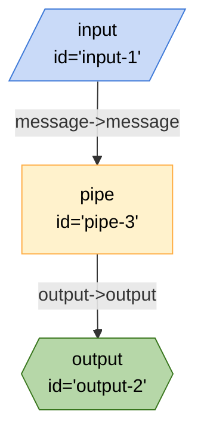

## Mermaid


## JSON
```json
{
	"title": "Xenova Code Node-Kit Board",
	"description": "Board which performs sentiment analysis using xenova LLM",
	"url": ".",
	"edges": [
		{
			"from": "pipe-3",
			"to": "output-2",
			"out": "output",
			"in": "output"
		},
		{
			"from": "input-1",
			"to": "pipe-3",
			"out": "message",
			"in": "message"
		}
	],
	"nodes": [
		{
			"id": "output-2",
			"type": "output",
			"configuration": {
				"schema": {
					"type": "object",
					"properties": {
						"output": {
							"type": "string",
							"title": "output"
						}
					}
				}
			}
		},
		{
			"id": "pipe-3",
			"type": "pipe",
			"configuration": {}
		},
		{
			"id": "input-1",
			"type": "input",
			"configuration": {
				"schema": {
					"type": "object",
					"properties": {
						"message": {
							"type": "string",
							"title": "message"
						}
					},
					"required": [
						"message"
					]
				}
			}
		}
	],
	"graphs": {}
}
```