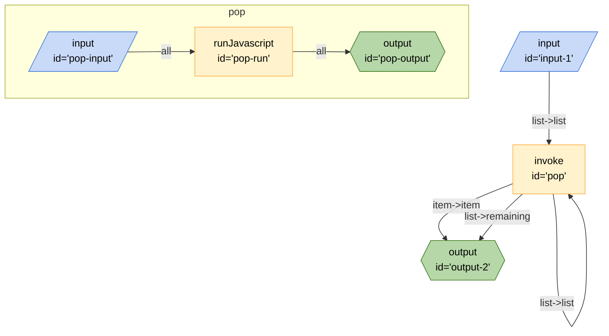

## Mermaid


## JSON
```json
{
	"edges": [
		{
			"from": "pop",
			"to": "pop",
			"out": "list",
			"in": "list"
		},
		{
			"from": "pop",
			"to": "output-2",
			"out": "item",
			"in": "item"
		},
		{
			"from": "pop",
			"to": "output-2",
			"out": "list",
			"in": "remaining"
		},
		{
			"from": "input-1",
			"to": "pop",
			"out": "list",
			"in": "list"
		}
	],
	"nodes": [
		{
			"id": "output-2",
			"type": "output",
			"configuration": {
				"schema": {
					"type": "object",
					"properties": {
						"item": {
							"type": "string",
							"title": "item"
						},
						"remaining": {
							"type": "string",
							"title": "remaining"
						}
					}
				}
			}
		},
		{
			"id": "pop",
			"type": "invoke",
			"configuration": {
				"$board": "#pop"
			}
		},
		{
			"id": "input-1",
			"type": "input",
			"configuration": {
				"schema": {
					"type": "object",
					"properties": {
						"list": {
							"type": "string",
							"title": "list"
						}
					},
					"required": [
						"list"
					]
				}
			}
		}
	],
	"graphs": {
		"pop": {
			"edges": [
				{
					"from": "pop-input",
					"to": "pop-run",
					"out": "*"
				},
				{
					"from": "pop-run",
					"to": "pop-output",
					"out": "*"
				}
			],
			"nodes": [
				{
					"id": "pop-input",
					"type": "input",
					"configuration": {}
				},
				{
					"id": "pop-run",
					"type": "runJavascript",
					"configuration": {
						"code": "function pop(inputs) {\n        if (inputs.list && Array.isArray(inputs.list) && inputs.list.length > 0) {\n            // return {};\n            const list = inputs.list;\n            const item = list.pop();\n            return { item, list };\n        }\n        return {};\n    }",
						"name": "pop",
						"raw": true
					}
				},
				{
					"id": "pop-output",
					"type": "output",
					"configuration": {}
				}
			]
		}
	}
}
```