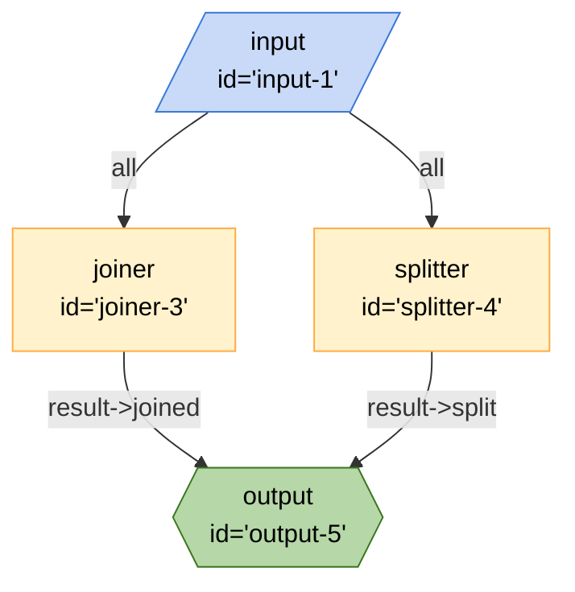

## Mermaid


## JSON
```json
{
  "edges": [
    {
      "from": "joiner-3",
      "to": "output-5",
      "out": "result",
      "in": "joined"
    },
    {
      "from": "splitter-4",
      "to": "output-5",
      "out": "result",
      "in": "split"
    },
    {
      "from": "input-1",
      "to": "joiner-3",
      "out": "*",
      "in": ""
    },
    {
      "from": "input-1",
      "to": "splitter-4",
      "out": "*",
      "in": ""
    }
  ],
  "nodes": [
    {
      "id": "output-5",
      "type": "output",
      "configuration": {
        "schema": {
          "type": "object",
          "properties": {
            "joined": {
              "type": "string",
              "title": "joined"
            },
            "split": {
              "type": "string",
              "title": "split"
            }
          },
          "required": [
            "joined",
            "split"
          ]
        }
      }
    },
    {
      "id": "joiner-3",
      "type": "joiner",
      "configuration": {}
    },
    {
      "id": "splitter-4",
      "type": "splitter",
      "configuration": {}
    },
    {
      "id": "input-1",
      "type": "input",
      "configuration": {}
    }
  ],
  "graphs": {}
}
```