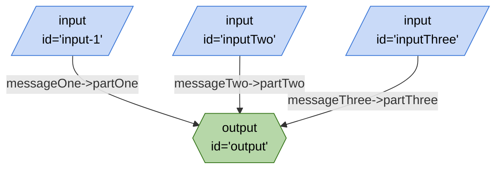

## Mermaid


## JSON
```json
{
	"edges": [
		{
			"from": "input-1",
			"to": "output",
			"out": "messageOne",
			"in": "partOne"
		},
		{
			"from": "inputTwo",
			"to": "output",
			"out": "messageTwo",
			"in": "partTwo"
		},
		{
			"from": "inputThree",
			"to": "output",
			"out": "messageThree",
			"in": "partThree"
		}
	],
	"nodes": [
		{
			"id": "output",
			"type": "output",
			"configuration": {
				"schema": {
					"type": "object",
					"properties": {
						"partOne": {
							"type": "string"
						},
						"partTwo": {
							"type": "string"
						},
						"partThree": {
							"type": "string"
						}
					}
				}
			}
		},
		{
			"id": "input-1",
			"type": "input",
			"configuration": {
				"schema": {
					"type": "object",
					"properties": {
						"messageOne": {
							"type": "string",
							"title": "messageOne"
						}
					},
					"required": [
						"messageOne"
					]
				}
			}
		},
		{
			"id": "inputTwo",
			"type": "input",
			"configuration": {
				"schema": {
					"type": "object",
					"properties": {
						"messageTwo": {
							"type": "string"
						}
					}
				}
			}
		},
		{
			"id": "inputThree",
			"type": "input",
			"configuration": {
				"schema": {
					"type": "object",
					"properties": {
						"messageThree": {
							"type": "string"
						}
					}
				}
			}
		}
	],
	"graphs": {}
}
```