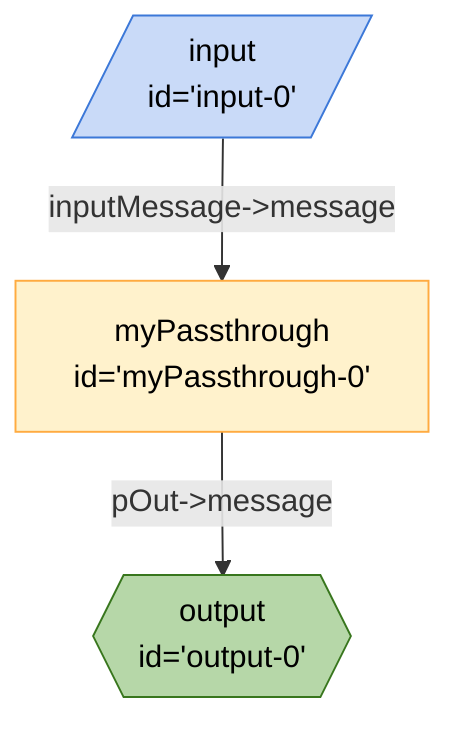

## Mermaid


## JSON
```json
{
	"edges": [
		{
			"from": "input-0",
			"to": "myPassthrough-0",
			"out": "inputMessage",
			"in": "message"
		},
		{
			"from": "myPassthrough-0",
			"to": "output-0",
			"out": "pOut",
			"in": "message"
		}
	],
	"nodes": [
		{
			"id": "input-0",
			"type": "input",
			"configuration": {
				"schema": {
					"type": "object",
					"properties": {
						"inputMessage": {
							"type": "string"
						}
					},
					"required": [
						"inputMessage"
					]
				}
			}
		},
		{
			"id": "output-0",
			"type": "output",
			"configuration": {
				"schema": {
					"type": "object",
					"properties": {
						"message": {
							"type": "string"
						}
					},
					"required": [
						"message"
					]
				}
			}
		},
		{
			"id": "myPassthrough-0",
			"type": "myPassthrough",
			"configuration": {}
		}
	]
}
```