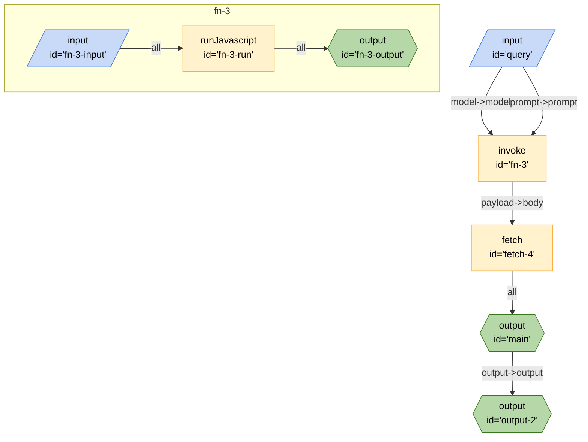

## Mermaid


## JSON
```json
{
	"edges": [
		{
			"from": "main",
			"to": "output-2",
			"out": "output",
			"in": "output"
		},
		{
			"from": "fetch-4",
			"to": "main",
			"out": "*",
			"in": ""
		},
		{
			"from": "fn-3",
			"to": "fetch-4",
			"out": "payload",
			"in": "body"
		},
		{
			"from": "query",
			"to": "fn-3",
			"out": "model",
			"in": "model"
		},
		{
			"from": "query",
			"to": "fn-3",
			"out": "prompt",
			"in": "prompt"
		}
	],
	"nodes": [
		{
			"id": "output-2",
			"type": "output",
			"configuration": {
				"schema": {
					"type": "object",
					"properties": {
						"output": {
							"type": "string",
							"title": "output"
						}
					}
				}
			}
		},
		{
			"id": "main",
			"type": "output",
			"configuration": {}
		},
		{
			"id": "fetch-4",
			"type": "fetch",
			"configuration": {
				"headers": {
					"content-type": "application/json"
				},
				"method": "POST",
				"url": "http://host.docker.internal:11434/api/generate"
			}
		},
		{
			"id": "fn-3",
			"type": "invoke",
			"configuration": {
				"stream": false,
				"$board": "#fn-3"
			}
		},
		{
			"id": "query",
			"type": "input",
			"configuration": {
				"schema": {
					"title": "Inputs for Ollama3 API call",
					"properties": {
						"model": {
							"type": "string",
							"title": "Ollama Model",
							"default": "llama3",
							"description": "The Ollama model to respond to the prompt"
						},
						"prompt": {
							"type": "string",
							"title": "Prompt",
							"default": "What are the continents called?",
							"description": "Prompt to ask Ollama Model"
						}
					}
				},
				"type": "string"
			}
		}
	],
	"graphs": {
		"fn-3": {
			"edges": [
				{
					"from": "fn-3-input",
					"to": "fn-3-run",
					"out": "*"
				},
				{
					"from": "fn-3-run",
					"to": "fn-3-output",
					"out": "*"
				}
			],
			"nodes": [
				{
					"id": "fn-3-input",
					"type": "input",
					"configuration": {}
				},
				{
					"id": "fn-3-run",
					"type": "runJavascript",
					"configuration": {
						"code": "function fn_3(input) {const payload=input;console.log(\"payload\",payload);return{payload}}",
						"name": "fn_3",
						"raw": true
					}
				},
				{
					"id": "fn-3-output",
					"type": "output",
					"configuration": {}
				}
			]
		}
	}
}
```