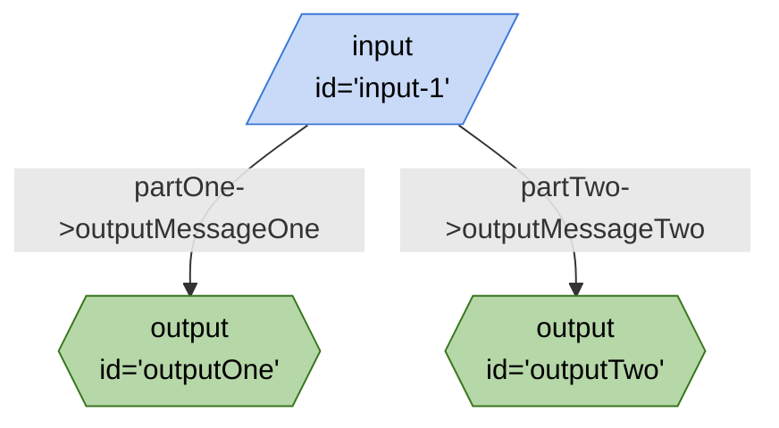

## Mermaid


## JSON
```json
{
	"title": "My Board Serialized",
	"description": "This is my board after serialization.",
	"url": ".",
	"edges": [
		{
			"from": "input-1",
			"to": "outputOne",
			"out": "partOne",
			"in": "outputMessageOne"
		},
		{
			"from": "input-1",
			"to": "outputTwo",
			"out": "partTwo",
			"in": "outputMessageTwo"
		}
	],
	"nodes": [
		{
			"id": "outputTwo",
			"type": "output",
			"configuration": {
				"schema": {
					"type": "object",
					"properties": {
						"outputMessageTwo": {
							"type": "string"
						}
					}
				}
			}
		},
		{
			"id": "input-1",
			"type": "input",
			"configuration": {
				"schema": {
					"type": "object",
					"properties": {
						"partOne": {
							"type": "string",
							"title": "partOne"
						},
						"partTwo": {
							"type": "string",
							"title": "partTwo"
						}
					},
					"required": [
						"partOne",
						"partTwo"
					]
				}
			}
		},
		{
			"id": "outputOne",
			"type": "output",
			"configuration": {
				"schema": {
					"type": "object",
					"properties": {
						"outputMessageOne": {
							"type": "string"
						}
					}
				}
			}
		}
	],
	"graphs": {}
}
```