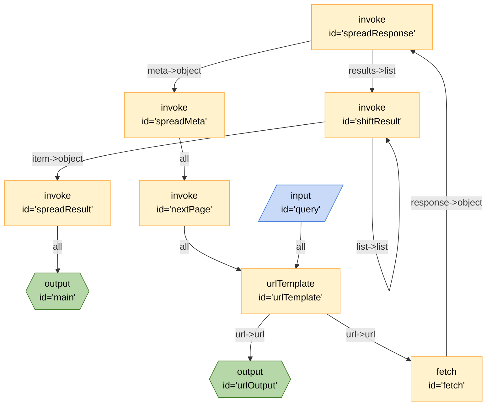

## Mermaid


## JSON
```json
{
	"edges": [
		{
			"from": "spreadResult",
			"to": "main",
			"out": "*",
			"in": ""
		},
		{
			"from": "shiftResult",
			"to": "shiftResult",
			"out": "list",
			"in": "list"
		},
		{
			"from": "shiftResult",
			"to": "spreadResult",
			"out": "item",
			"in": "object"
		},
		{
			"from": "spreadResponse",
			"to": "spreadMeta",
			"out": "meta",
			"in": "object"
		},
		{
			"from": "spreadResponse",
			"to": "shiftResult",
			"out": "results",
			"in": "list"
		},
		{
			"from": "fetch",
			"to": "spreadResponse",
			"out": "response",
			"in": "object"
		},
		{
			"from": "spreadMeta",
			"to": "nextPage",
			"out": "*",
			"in": ""
		},
		{
			"from": "urlTemplate",
			"to": "urlOutput",
			"out": "url",
			"in": "url"
		},
		{
			"from": "urlTemplate",
			"to": "fetch",
			"out": "url",
			"in": "url"
		},
		{
			"from": "nextPage",
			"to": "urlTemplate",
			"out": "*",
			"in": ""
		},
		{
			"from": "query",
			"to": "urlTemplate",
			"out": "*",
			"in": ""
		}
	],
	"nodes": [
		{
			"id": "main",
			"type": "output",
			"configuration": {}
		},
		{
			"id": "spreadResult",
			"type": "invoke",
			"configuration": {
				"$board": "#spreadResult"
			}
		},
		{
			"id": "shiftResult",
			"type": "invoke",
			"configuration": {
				"$board": "#shiftResult"
			}
		},
		{
			"id": "spreadResponse",
			"type": "invoke",
			"configuration": {
				"$board": "#spreadResponse"
			}
		},
		{
			"id": "fetch",
			"type": "fetch",
			"configuration": {
				"method": "GET"
			}
		},
		{
			"id": "spreadMeta",
			"type": "invoke",
			"configuration": {
				"$board": "#spreadMeta"
			}
		},
		{
			"id": "urlTemplate",
			"type": "urlTemplate",
			"configuration": {
				"template": "https://api.openalex.org/{entity}?search={search}&page={page}&per_page={per_page}&select={select}",
				"page": 1,
				"entity": "works",
				"select": "id,display_name,title,relevance_score"
			}
		},
		{
			"id": "nextPage",
			"type": "invoke",
			"configuration": {
				"$board": "#nextPage"
			}
		},
		{
			"id": "query",
			"type": "input",
			"configuration": {
				"title": "Search OpenAlex",
				"schema": {
					"required": [
						"search"
					],
					"properties": {
						"search": {
							"type": "string"
						},
						"page": {
							"type": "integer",
							"default": "1"
						},
						"per_page": {
							"type": "integer",
							"default": "200"
						},
						"entity": {
							"type": "string",
							"default": "works",
							"enum": [
								"works",
								"authors",
								"sources",
								"institutions",
								"topics",
								"publishers",
								"funders",
								"concepts"
							]
						}
					}
				}
			}
		},
		{
			"id": "urlOutput",
			"type": "output",
			"configuration": {
				"schema": {
					"type": "object",
					"properties": {
						"url": {
							"title": "url",
							"description": "The resulting URL that was produced by filling in the placeholders in the template",
							"type": "string"
						}
					}
				}
			}
		}
	],
	"graphs": {
		"spreadResult": {
			"edges": [
				{
					"from": "spreadResult-input",
					"to": "spreadResult-run",
					"out": "*"
				},
				{
					"from": "spreadResult-run",
					"to": "spreadResult-output",
					"out": "*"
				}
			],
			"nodes": [
				{
					"id": "spreadResult-input",
					"type": "input",
					"configuration": {}
				},
				{
					"id": "spreadResult-run",
					"type": "runJavascript",
					"configuration": {
						"code": "function spreadResult(inputs) {\n    const object = inputs.object;\n    if (typeof object !== \"object\") {\n        throw new Error(`object is of type ${typeof object} not object`);\n    }\n    return Object.assign({}, object);\n}",
						"name": "spreadResult",
						"raw": true
					}
				},
				{
					"id": "spreadResult-output",
					"type": "output",
					"configuration": {}
				}
			]
		},
		"shiftResult": {
			"edges": [
				{
					"from": "shiftResult-input",
					"to": "shiftResult-run",
					"out": "*"
				},
				{
					"from": "shiftResult-run",
					"to": "shiftResult-output",
					"out": "*"
				}
			],
			"nodes": [
				{
					"id": "shiftResult-input",
					"type": "input",
					"configuration": {}
				},
				{
					"id": "shiftResult-run",
					"type": "runJavascript",
					"configuration": {
						"code": "function shiftResult(inputs) {\n    if (inputs.list && Array.isArray(inputs.list) && inputs.list.length > 0) {\n        const list = inputs.list;\n        const item = list.shift();\n        return { item, list };\n    }\n    return {};\n}",
						"name": "shiftResult",
						"raw": true
					}
				},
				{
					"id": "shiftResult-output",
					"type": "output",
					"configuration": {}
				}
			]
		},
		"spreadResponse": {
			"edges": [
				{
					"from": "spreadResponse-input",
					"to": "spreadResponse-run",
					"out": "*"
				},
				{
					"from": "spreadResponse-run",
					"to": "spreadResponse-output",
					"out": "*"
				}
			],
			"nodes": [
				{
					"id": "spreadResponse-input",
					"type": "input",
					"configuration": {}
				},
				{
					"id": "spreadResponse-run",
					"type": "runJavascript",
					"configuration": {
						"code": "function spreadResponse(inputs) {\n    const object = inputs.object;\n    if (typeof object !== \"object\") {\n        throw new Error(`object is of type ${typeof object} not object`);\n    }\n    return Object.assign({}, object);\n}",
						"name": "spreadResponse",
						"raw": true
					}
				},
				{
					"id": "spreadResponse-output",
					"type": "output",
					"configuration": {}
				}
			]
		},
		"spreadMeta": {
			"edges": [
				{
					"from": "spreadMeta-input",
					"to": "spreadMeta-run",
					"out": "*"
				},
				{
					"from": "spreadMeta-run",
					"to": "spreadMeta-output",
					"out": "*"
				}
			],
			"nodes": [
				{
					"id": "spreadMeta-input",
					"type": "input",
					"configuration": {}
				},
				{
					"id": "spreadMeta-run",
					"type": "runJavascript",
					"configuration": {
						"code": "function spreadMeta(inputs) {\n    const object = inputs.object;\n    if (typeof object !== \"object\") {\n        throw new Error(`object is of type ${typeof object} not object`);\n    }\n    return Object.assign({}, object);\n}",
						"name": "spreadMeta",
						"raw": true
					}
				},
				{
					"id": "spreadMeta-output",
					"type": "output",
					"configuration": {}
				}
			]
		},
		"nextPage": {
			"edges": [
				{
					"from": "nextPage-input",
					"to": "nextPage-run",
					"out": "*"
				},
				{
					"from": "nextPage-run",
					"to": "nextPage-output",
					"out": "*"
				}
			],
			"nodes": [
				{
					"id": "nextPage-input",
					"type": "input",
					"configuration": {}
				},
				{
					"id": "nextPage-run",
					"type": "runJavascript",
					"configuration": {
						"code": "function nextPage({ page = 1, count, per_page = 200 }) {\n    const finalPage = Math.ceil(count / per_page);\n    const nextPage = page + 1;\n    if (nextPage > finalPage) {\n        return {};\n    }\n    return { page: nextPage, per_page, count };\n}",
						"name": "nextPage",
						"raw": true
					}
				},
				{
					"id": "nextPage-output",
					"type": "output",
					"configuration": {}
				}
			]
		}
	},
	"$schema": "https://raw.githubusercontent.com/breadboard-ai/breadboard/main/packages/schema/breadboard.schema.json"
}
```