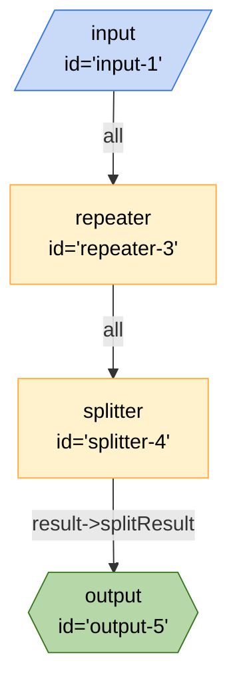

## Mermaid


## JSON
```json
{
	"edges": [
		{
			"from": "splitter-4",
			"to": "output-5",
			"out": "result",
			"in": "splitResult"
		},
		{
			"from": "repeater-3",
			"to": "splitter-4",
			"out": "*",
			"in": ""
		},
		{
			"from": "input-1",
			"to": "repeater-3",
			"out": "*",
			"in": ""
		}
	],
	"nodes": [
		{
			"id": "output-5",
			"type": "output",
			"configuration": {
				"schema": {
					"type": "object",
					"properties": {
						"splitResult": {
							"type": "string",
							"title": "splitResult"
						}
					},
					"required": [
						"splitResult"
					]
				}
			}
		},
		{
			"id": "splitter-4",
			"type": "splitter",
			"configuration": {}
		},
		{
			"id": "repeater-3",
			"type": "repeater",
			"configuration": {}
		},
		{
			"id": "input-1",
			"type": "input",
			"configuration": {}
		}
	],
	"graphs": {}
}
```